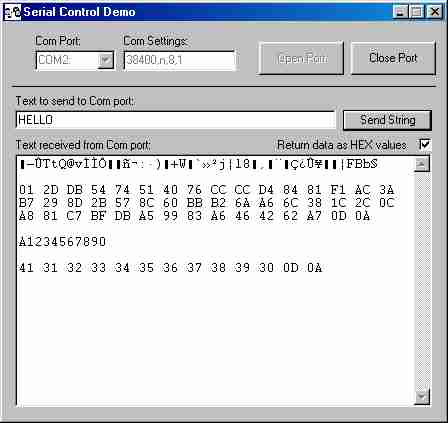



## Serial Com User Control

### Description

This is an event driven VB user control to handle serial COM communications. Instead of using the default ocx you can now compile this user control with your code and you don't need to supply any extra ocx's or third party dll's to support serial comm's.
 
### More Info
 
When you are in the VB runtime and you stop the code execution with the little stop button in VB it may crash VB completely. This unfortunately is very difficult to fix. Rather let your program exit normally than a abrupt stop.

             |
---                |---
**Submitted On**   |2000-10-31 11:13:24
**By**             |[Riaan Aspeling](https://github.com/Planet-Source-Code/PSCIndex/blob/master/ByAuthor/riaan-aspeling.md)
**Level**          |Advanced
**User Rating**    |4.2 (25 globes from 6 users)
**Compatibility**  |VB 6\.0
**Category**       |[Files/ File Controls/ Input/ Output](https://github.com/Planet-Source-Code/PSCIndex/blob/master/ByCategory/files-file-controls-input-output__1-3.md)
**World**          |[Visual Basic](https://github.com/Planet-Source-Code/PSCIndex/blob/master/ByWorld/visual-basic.md)
**Archive File**   |[CODE\_UPLOAD1114710312000\.zip](https://github.com/Planet-Source-Code/riaan-aspeling-serial-com-user-control__1-12423/archive/master.zip)

